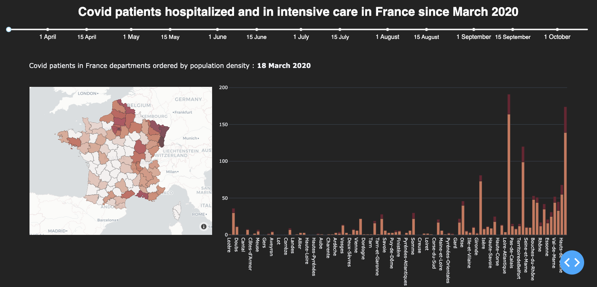

# Covid-19 Data Visualization

The aim of this project is a to create a dashboard to visualize the Covid-19 data in France. The dashbord has been made using plotly and dash in python. 




# Installation 

I encourage you to install the requirements in a virtual python environement. I am using python 3.8.2. 

To install the virualenv package :
```
pip install virtualenv 
```
Create a virtual environement :
```
virtualenv Covid
```

Activate the virtual environement : 
```
source Covid/bin/activate 
```

Install all requirements in the virtual environement : 
```
pip install -r requirements.txt  
```

# Run the project

After cloning the project go to the repository and do the following command :
```
python3 plot.py 
```

